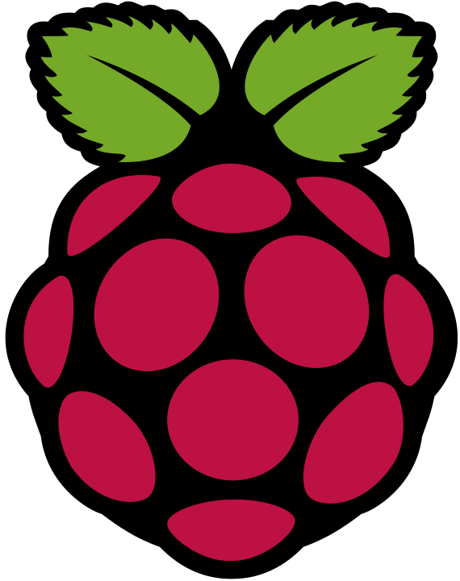
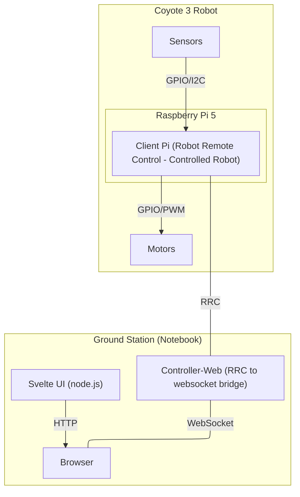

# B.R.E.M.E.N. code
Code of the team B.R.E.M.E.N - winner of the [ESA ESRIC Space Resource Challenge 2025](https://src.esa.int/)

 

This git organisation hosts the repositories with the code that was used in the ESA ESRIC Space Resource Challenge.

## Motivation
This code can be used as reference implementation for similar systems or to learn how to use certain libraries.

## Repository Overview

<table cellpadding="0" cellspacing="0">
    <tr>
        <td>
            
        </td>
        <td>
            <a href="https://github.com/esa-esric-bremen/controller-web"><b>Controller Web</b></a>
        </td>
        <td>
            Robot controller that forwards incoming commands from the browser via WebSocket.
        </td>
    </tr>
    <tr>
        <td>
            
        </td>
        <td>
            <a href="https://github.com/esa-esric-bremen/client-pi"><b>Client Pi</b></a>
        </td>
        <td>
            Raspberry Pi Client using <a href="https://github.com/dfki-ric/robot_remote_control">Robot Remote Control</a> in C++
        </td>
    </tr>
    <tr>
        <td>
            
        </td>
        <td>
            <a href="https://github.com/esa-esric-bremen/svelte-ui"><b>Svelte UI</b></a>
        </td>
        <td>
            <a href="https://svelte.dev">Svelte</a> based Web User Interface in TypeScript using <a href="https://sveltematerialui.com">svelte-material-ui</a> and <a href="https://codeberg.org/brean/smui-gamepad-components">smui-gamepad-components</a> to control the robot and excavation system with a gamepad.
        </td>
    </tr>
    <tr>
        <td>
            
        </td>
        <td>
            <a href="https://github.com/esa-esric-bremen/esa-src-docker-env"><b>docker-env</b></a>
        </td>
        <td>
            Docker Environment as development environment simulating the Hardware and testing the UI (hosts the other repositories as submodules)
        </td>
    </tr>
</table>

- **svelte-ui**: 
- **docker-env**: Docker Environment as development environment simulating the Hardware and testing the UI (hosts the other repositories as )

### Why is this interesting for you?
1. There are not many real-world implementations using [Robot Remote Control](https://github.com/dfki-ric/robot_remote_control), you can use this project as reference implementation.
1. The client-pi software implements driver for different hardware that to work with the Raspberry Pi, you can take the code as driver for your project, this includes:
    -  ADS1x15 voltage measurement
    -  HX711 weight cells (note that this code is translated from [this python code](https://github.com/tatobari/hx711py/blob/master/hx711.py) to C++ with support of Google Gemini)
    -  INA228 current/voltage measurement (not used in the challenge as we used an ADS1115)
    -  l298n motor control
    -  GPIO using the [wiring-pi](https://github.com/WiringPi/WiringPi) modern rewrite
    -  vcgencmd to get the CPU temperature and throttled information
1. A system to control a robot using a modern UI-framework.

## System Overview
The code was deployed on two raspberry pi 5: one stationary at the stationary beneficiation station developed by DLR and one to control the excavation system on the robot itself.

